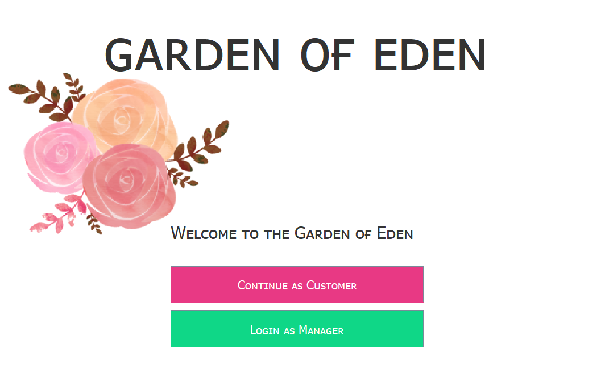
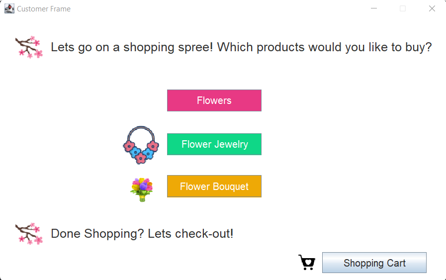
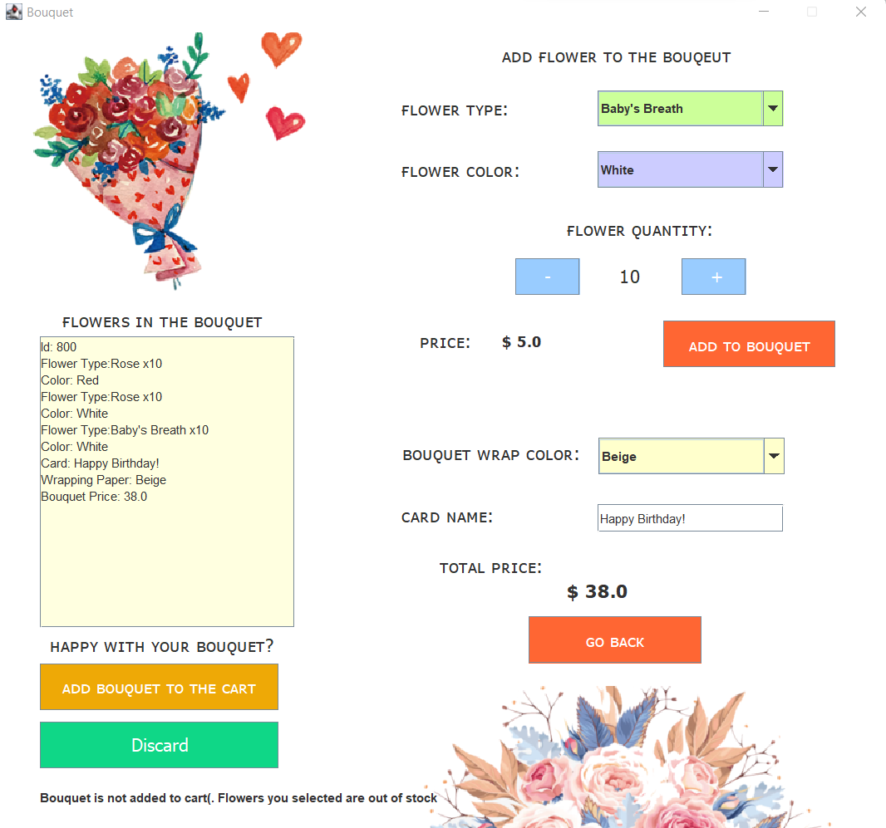
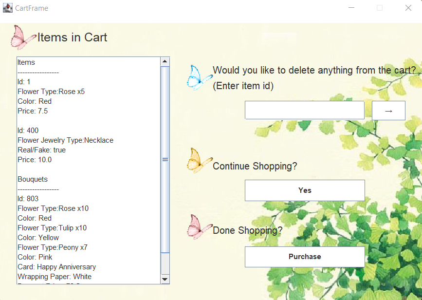
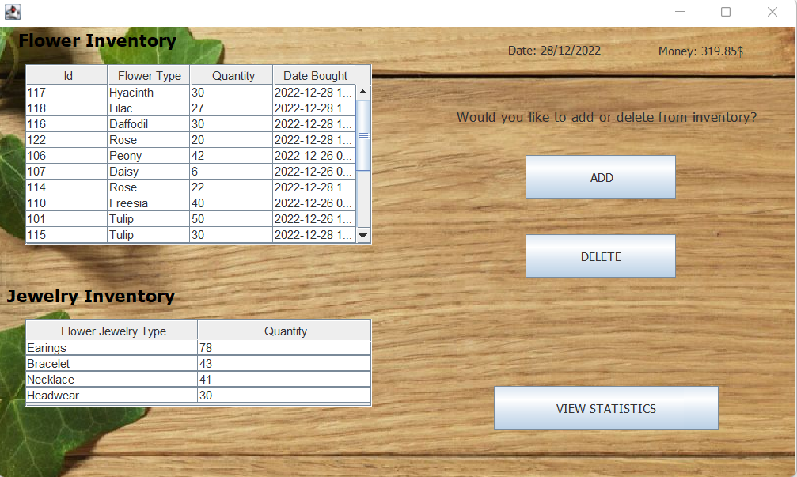

# Garden of Eden
:blossom: :rose: Garden of Eden is a flower shop app with some management features.
Garden of Eden was built using Java and MySQL

 * Users can purchase flowers and flower jewelry
 * Create their own bouquets
 * Add/Delete from cart
 * Manager can keep track of inventory
 * Add/Delete from inventory
 * Delete all expired products
 * Keep track of statistics

 

    # Installation
    All of the tables are local. To be able to run the project you have to create the schema on your pc.

    ### Links to install MySQL and Workbench
    https://dev.mysql.com/downloads/windows/installer/5.7.html  
    https://dev.mysql.com/downloads/workbench/

    ### Setting up account
    
    For the project we used ``` root ``` account  with password ``` 9862 ```\
     ``` ALTER USER 'root'@'localhost' IDENTIFIED BY '9862' ```

    ### Creating the schema
    Copy everything inside ``` dbCreationInsertion.sql ```\
    Paste in Workbench. Select everything and execute
    
## Authors

- [@YunoGasasi9862](https://github.com/YunoGasasi9862)
- [@kamilaalv](https://github.com/kamilaalv)
- [@ImanZahid](https://github.com/ImanZahid)
- [@ShinigamiEyesOnYou](https://github.com/ShinigamiEyesOnYou)


## Screenshots







## Additional
Info to access management part: Login: ```admin``` Password: ```password```

## UML
[here](Garden%20of%20EdenUML.pdf)


